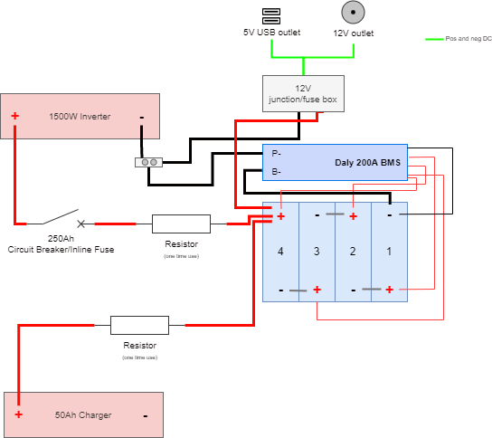

# DIY Power Station
This repo shows the progress of two young doughnuts building a power station for off-grid outdoor DJ music sessions with the lads.

We're building a **280Ah 12V power station able to withstand 1500W**. These were the specs we found best suited our needs. Since we are powering two speakers, a laptop, DJ mixer and lights, this gig is expected to give around 10 hours of non-stop tunes :notes:.

## Overview
Here's an overview of the power station, its components and the intended outlets.

  

### Battery case
We have a layout of the case that will compress the cells and have a structure to roof the BMS on top of the cells. This unit will act as the battery and will encompass of the 280Ah cells and Daly BMS 200Ah.

The Lightburn project file assumes the usage of `9mm` plywood.
