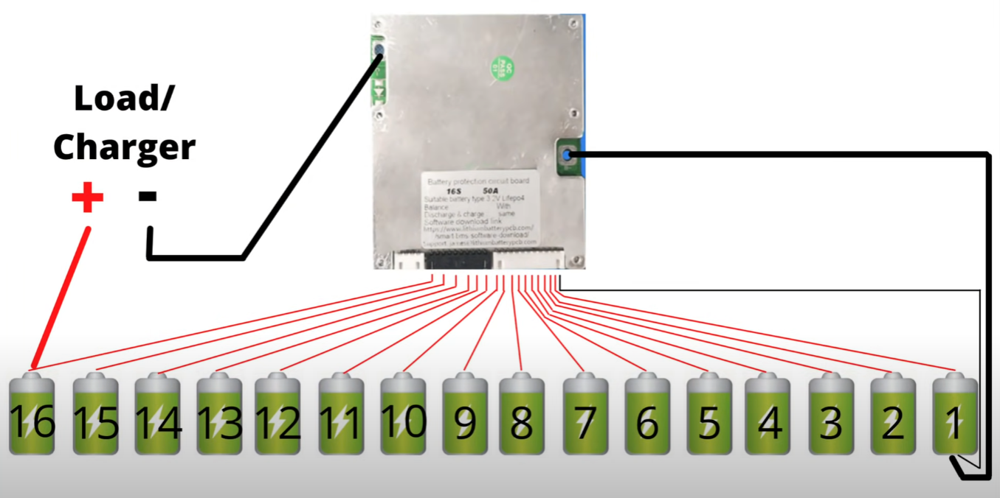

# DIY Power Station
This repo shows the progress of two young doughnuts building a power station for off-grid outdoor DJ music sessions with the lads.

We're building a **280Ah 12V power station able to withstand 1500W**. These were the specs we found best suited our needs. Since we are powering two speakers, a laptop, DJ mixer and lights, this gig is expected to give around 10 hours of non-stop tunes :notes:.

# Table of Contents
1. [Preface](#preface)
2. [Materials Overview & Design](#overview)
3. [Assembly](#assembly)
4. [Just use it now!](#useitnow)

## Mate, why don't you buy a pre-made power station? :thinking: 
Glad you asked! Simple answer: *they're too expensive for what they're worth*. Even if you have warranty, the price per Wh (watt-hour) is ludicrous when compared to DIY solutions.

I don't need to link examples here. I'd be hard-pressed if you found a 280Ah 12V power station capable of running up to 1500W concurrent watts for less than 2000€ in the market. Ours caps at 1000€ (yes, including DDP shipping costs) and also offers a great learning experience! Plus, you have the advantage of **modularity**, meaning you can add more cells in the future if you want. Or perhaps add more outlets? Or maybe add a solar controller so you can plug your solar panels? Maybe you can add a temp controller and add a few fans to control the temperature inside the case?

It's up to you to decide! :smile:

## Materials Overview & Design 
Here's an overview of the power station, its components and the intended outlets. Bear in mind, this power station is *basic*; it only has the components we find essential. Sure, we can install a fan and controller for ventilation (and it is really cheap to do so) but we prefer to keep it simple here.

  

This is our personal opinion on what the power station should have *at minimum*. We've religiously followed [DIY Solar Forum's advice](https://diysolarforum.com/) on the best parts and cheapest approach possible (shout out to [Will Prowse](https://www.youtube.com/c/WillProwse), his channel is a goldmine for DIY generators and batteries). Granted, the forum's main focus lies on solar generators. However, we forewent some of the components since our power station is meant for outdoor, off-grid use and not to be connected to solar panels.

Henceforth, our basic list includes:
- [4pcs EVE 280Ah 3.2V cells](https://www.alibaba.com/product-detail/Exliporc-GER-New-Arrival-STOCK-3_1600189394072.html?spm=a2756.order-detail-ta-ta-b.0.0.ae512fc2j1AOER)
- [Daly BMS 200Ah 4s](https://offgridvan.life/shop/daly-12v-200a-bms-for-4s-lifepo4-battery)
- [1500W 12V 50Hz inverter](https://www.banggood.com/Mensela-IT-PS1-Pro-220V-50HZ-Intelligent-Screen-Solar-Pure-Sine-Wave-Power-Inverter-2200W-or-3000W-or-4000W-or-5000W-or-6000W-or-7000W-DC-50HZ-12V-or-24V-To-AC-220V-Converter-p-1789663.html?utm_source=emarsys&utm_medium=Outofstocknosplit&utm_campaign=trigger-order&utm_content=leander&sc_src=email_5007166&sc_eh=dc563cd3b58e91061&sc_llid=112806&sc_lid=225205703&sc_uid=7uZyj2v05v&cur_warehouse=CN&ID=518349555089)
- [WATE 14.6V 50Ah charger](https://pt.aliexpress.com/item/4000457912081.html?spm=a2g0o.order_list.0.0.3c89caa4neo3Uo&gatewayAdapt=glo2bra)
- basic hardware (plywood, resistor, fuse boxes, 250Ah circuit breaker, outlets, PTFE, screws, threaded bars, washers, cables, 2x handles)

### Battery
When choosing a battery, it's important to know what type of cells to go for. We could have bought a pre-made AGM but it wouldn't be as cheap. So we decided to build one ourselves! Lithium Iron Phosphate batteries (known as **LiFePO4**) are a type of lithium ion rechargeable battery. They're cheaper, have better power output, weigh less and have double the cycles of traditional cobalt-based lithium ion batteries.

Given we decided to build a 12V a battery, we'd need ***four 3.2V cells in series***. We just needed to choose our capacity. Every concern and requirement goes back into the old adage:

$$ W = V \cdot A$$

**Watts** equals to **volts** times **ampere**. Here's a list of our gear and their respective *consumption wattage*.

| Item             | Watts       |
| --------------   | ----------- |
| 2x Partybox 100  | 120W        |
| Laptop           | 50W         |
| Lights           | 60W         |
| Mixer            | 20W         |
| Laser            | 25W         |
| Fog machine      | 20W         |

They roughly add up to 295W. Using the formula, considering a 12V battery, we're looking at **25 amperes**. With this in mind, we went for **280Ah (amp/hour) cells**. We estimate that with these, taking into account 90% efficiency from the inverter and 90% efficiency discharge from the battery itself, it would leave us with a *very conservative, worst case scenario* window between 200-220Ah. This can translate to **a minimum 8 hours of full-blast outdoor DJ sets with lights, fog machine and laser** :tada: .

> We're not even *considering* that both speakers have in-built batteries that last up 6 hours by themselves and that the fog machine is used intermittently. The laptop also has its own battery!

#### Cells
The core of the battery. The cheapest options are across the globe, in China. [But it has its own risks](https://www.youtube.com/watch?v=EYqemUdIo08). Some cells in Alibaba, Aliexpress or Banggood are ridiculously cheap. But most of the times it's too good to be true. So you have to be careful.

There are infinite discussions about which Chinese brands are best or give the best bang for your buck. To keep it simple, and following DIYSolarForum's and Will Prowse's suggestions, try to stick to Grade A EVE LF280K (they're a Chinese manufacturer) cells.. There are many sellers who sell EVE cells (not all are legitimate, watch out!) on the most common Chinese e-commerce sites (Alibaba, Aliexpress...). [Amy Wuan](https://diysolarforum.com/threads/amy-wan-vs-amy-zheng-whats-the-difference.36957/) has a great reputation in the forums and it's your safest bet (even if they mess up, they usually just send you a replacement package).

Needless to say, you pay a wee more if you bet on Amy Wuan. You're essentially paying premium for the *safety* of having cheap Grade-A EVE cells. We took a *riskier approach*. We went for Exliporc as the seller, through Lillian Li. It's a bit more daring but people have ordered from them in the past and it's they seem to uphold a [satisfactory reputation](https://diysolarforum.com/threads/new-eve-lf280k-16s-build-from-exliporc.38130/).

Here's hoping! :crossed_fingers:

When purchasing, do ask for a photo of the cells QR Codes. They are extremely helpeful to verify if the cells are legit and Grade-A. [Here's a quick way of reading the cell QR Code](https://www.reddit.com/r/LiFePO4battery/comments/pujggt/how_to_quickly_identify_fake_lfp_battery_cells/).

Don't forget to check the box when they arrive and run capacity tests on the cells to check for their health and true capacity. You can open disputes on Alibaba and try to score a refund (try to pay with credit card or Paypal for better protection).

----

##### Notes about cells when they arrive
It's important to top balance the cells. Here's a quick lesson about voltage and discharge capacity on LiFePO4 cells. Check the following image. These cells maintain roughly the same voltage between 90% and 20% capacity.

  

So when you open up your brand new cells and observe that the voltage is 3.25V, it means the battery can be 40% or 80% charged, for example.

Now take this and put four cells in series (thus making a 12V battery). If you use the battery, they all discharge at the same time. It means that one cell might be discharged *first* than the others (under-charge). The same thing can happen when charging, leading to over-charge. This is damaging to the cells long-term and can seriously effect their lifespan.

  

Therefore, we **top-balance them**. In other words, we charge all the cells to the same capacity and voltage and make sure they're all lined up! There are loads of videos on how to top balance (here's [two](https://www.youtube.com/watch?v=x5ABvbbics8&t=2s) of our [favourites](https://www.youtube.com/watch?v=RPtT8KAtsJA)). In layman's terms, you connect the cells in parallel and use a DC charger to charge them up to 3.65V. This is the simplest way of doing it. Check the second video linked for a faster approach.

Don't forget to clamp the cells while charging! Cell compression helps extend their lifespan and it's good for their overall health! Check the [Case](#case) section for more details.

> :v: **Quick tip** If you don't have a DC charger, I recommend you getting the [EBC-A20](https://pt.aliexpress.com/item/1005003097310721.html?spm=a2g0o.search0304.0.0.7d0516d9igJgla&algo_pvid=854fff39-1335-4a75-ad1d-4145f4b768a2&algo_exp_id=854fff39-1335-4a75-ad1d-4145f4b768a2-14&pdp_ext_f=%7B%22sku_id%22%3A%2212000024063776342%22%7D&pdp_npi=2%40dis%21EUR%21%21102.34%21%21%2111.73%21%21%400bb0623316541173981173071e2a88%2112000024063776342%21sea&gatewayAdapt=glo2bra) tester. This little machine discharges the battery at 20Ah and charges it at 5Ah. The great thing about it is that you can run capacity tests with it (it comes with a software that plots the graph for you) and also charges the battery (albeit a bit slow). It's the best bang for your buck if you want to run capacity tests and charge your cells for top-balancing.

> You [really should](https://www.youtube.com/watch?v=3dmWqHR7b9w) run capacity tests to check for the cells' true capacity and their overall health. [Here's a great rundown](https://www.youtube.com/watch?v=bx7Df_nbv0A) for the aforementioned capacity tester. Trust me, it's really useful, cheap and simple!

----

#### BMS
The BMS, also known as battery management system, is what will keep your battery balanced throughout its usage, whilst discharging and charging. There are schools of thoughts that would say that BMS are unnecessary, and top balancing and bottom balancing are enough. However we're looking for a degree of security. BMS also can give us information about current/voltage/usage and set cut-off settings, so it's not only necessary but also useful.

Forum's most used BMS tend to be Daly's, mostly because they're cheap and tend to do their job properly. One can also buy a bluetooth dongle and temp sensor to tweak settings.

###### Choosing correct amperage
Choosing the BMS amperage depends on two factors: how much discharge you're expecting to run through the inverter and the [cells specification](http://www.dcmax.com.tw/LF280(3.2V280Ah).pdf).

The latter specifies that 1C is the maximum discharge current, which means one full capacity, translating to 280A in our case. The former factor means that with an inverter of 1500W, at 12V, it translates to 125A current. Taking these two numbers, we went for a 200Ah BMS, even though we could have chosen a 150Ah as well. We bet on the 200Ah range mainly because of price and the thick gauge cables. One would usually order from China but we found a seller in the UK which, even with shipping and customs tax, had a cheaper price. The link is posted on the components list above.

> :warning: Please note that BMS' also have a charging limit. So consider the battery charger amperage according to the BMS you end up using. In our case, the BMS had a 100Ah charging limit and we ended up using a 20Ah WATE charger.

###### Hooking to the battery
We need to connect the BMS to the battery. We highly recommend purchasing [M6 connector nuts](https://www.amazon.es/s?k=m6+connector+nut&geniuslink=true&tag=nigelivy0f1-21) (to keep the BMS leads in place) and [heat shrink lugs](https://www.amazon.es/dp/B088ZSCWTR?tag=nigelivy0f1-21&geniuslink=true) (to clamp on balance leads, making it easier to connect ot the battery.

After cramping each BMS balance lead with the lugs, we hook the negative lead to the negative of the battery. The positive leads from the BMS connect to the battery's *in order* (the order is usually found in the BMS itself but you can easily find online if you're having trouble). We're looking to do something like the following picture.

  

That should do it. But it's best to double check the voltage of each terminal in the BMS to make sure all the leads were plugged in the correct order. You can use the voltmeter to check if the difference between the negative terminal and the positive is 3.5V, incrementing 3.5V the furthest you go along the BMS terminals. Like in the following picture.

  

The image shows the 4th positive terminal, so it should be four increments of 3.5V, which are 14V (as shown in the picture). This tells us that thus far the terminals are correctly plugged.

Once you're done, just screw the nuts and you have yourself a fancy battery with a nice BMS :tada:! Give yourself a pat on the back!

#### Case
We have a layout of the case that will compress the cells when charging/top balancing (people find it optional but [it's been proven that compression helps extending the cells' lifespan, given they tend to bloat when charged](https://www.youtube.com/watch?v=cwBxe4cu3yo)) and have a structure to roof the BMS on top of the cells. This unit will act as the battery and will encompass of the 280Ah cells and Daly BMS 200Ah.

> :warning: When arranging the batteries between the two clamps, do not forget to add some insulator material between the cells. The blue plastic wraps that come with the batteries are not enough to protect the cells from shorting - imagine if the thin plastic wrap breaks, you're done! Therefore, we recommend buying PTFE and inserting them between the cells. It's a good insulator and melts at extremely high temperatures, so don't worry!

The Lightburn project file assumes the usage of **9mm plywood**. Since we luckily can use [a 130W CO2 laser cutting machine](https://github.com/nelsonic/nelsonic.github.io/issues/455#issuecomment-549803532) (huge thank you to [@nelsonic](https://github.com/nelsonic)), the speed and power settings of each layer have been tweaked using [this calculator](https://mantechmachinery.co.uk/laser-cutter-parameters/), to both cutting and engraving.

### Inverter
The inverter is the second most important piece of the power station. To pick an inverter is simple: choose the max wattage you're expecting your power station to handle **given that the battery can withstand the current**.

For our case, we went for a 1500W nominal current inverter (with peak 3000W). That's 125A. So our battery, in theory, can last for a little bit over an hour at this rate. When choosing your inverter, you need to know the cells' *max discharge current* - this is the maximum current the cells can withstand without damage. For our case, as it was mentioned previously is 1C. Therefore, our inverter shouldn't be able to pull more than the battery's capacity in hours, which is 280A.

You can't go wrong with inverters. The more you pay, the longer they last and the better their efficiency. [This](https://www.youtube.com/watch?v=1rxSapfp4Hs) is a great video if you want a buyer's guide. Ignore the title, it's not specific to solar generators. In short, Giandel's inverters are the cheapest option you can get on the "reliable" range. We opted for a Chinese-manufactured inverter, though. The reason we did this was for experimental reasons. We don't expect to use the power station everyday, so we can opt for a more budget-friendly inverter that can last a reasonable amount of time and still give us decent efficiency at a cheaper price range.

> :warning: Go for **pure sine inverters**. Forget modified sine wave inverters, they can damage your appliances.

> Also, beware of your region's grid frequency. For example, Europe's grid runs at 50Hz but America's and Japan's run at 60Hz. So check it before buying your inverter!

###### Connecting the inverter to the battery
Here's a quick note before you connect your inverter to the battery. You should charge up the inverter's capacity first before connecting to the battery. If you don't, the terminal can spark and splash hot metal into your eyes.

For this, you can use a cheap resistor to pre-charge the inverter's capacitors. It's really simple! You can follow a guide [here](https://www.youtube.com/watch?v=ZlrtmJRfSP8).

### Charger
LiFePO4 batteries are rechargeable. What we need is a **DC charger** to connect to the battery (the same way you charge car batteries). There are several chargers that convert AC to DC at a given ampere rate. Therefore, the less the amperage output, the slower the charging process will be.

We recommend [WATE chargers](https://www.youtube.com/watch?v=wkeiRsDJwsk). They're cheap and reliable and offer great amperage given their price. Just make sure to purchase the right voltage when buying a charger. In our case, since we can charge our 12V battery up to 14.6V, we bought the charger with this voltage that charges the battery at 50A. This should fully recharge the battery in less than 6 hours.

### Circuit breaker/inline fuse
For security purposes, you should get an inline fuse or a circuit breaker between the inverter and the battery. This is because we don't want to overload the battery.

As the name entails, these break the current when reaching a specific amperage. Not sure how much amperage your circuit breaker/fuse ought to have? No worries, check [this table](https://www.altestore.com/diy-solar-resources/recommended-inverter-cables-sizing-and-breakers-or-fuses/)!

## Assembly 
The assembly process consists of two parts: the battery unit and the rest of the power station. We wanted the battery unit to be easily removable, hence why we added handles to its case.

### Battery unit
We previously mentioned we took a riskier approach on getting slightly cheaper EVE cells with another seller called Lillian Li. Needless to say they provided great communication and support. Even though it took nearly 2 months for the cells to arrive, they were in good condition and thoroughly passed the capacity tests.

  
  

The assembly process could be described by text here but its much easier to follow [the video](https://www.youtube.com/watch?v=-ZxcGc59M60) we used as reference. We've followed this video step by step and everything worked at the end. We now have a fully top-balanced battery unit (it took roughly 5 days to fully top-balance the batteries) with a BMS that can be accessed with an app and tweak the settings by bluetooth (and check state of charge, voltage delta, etc...).

> :warning: Do not touch the positive and negative lead of the battery unit coming out of the BMS. This will cause a short and potentially ruin the battery and be dangerous as it creates a spark. It happened two times with us and luckily it was a split second spark so nothing severe happened. But please beware, there's a reason we wrapped the positive lead with bubble wrap in the picture above!

### The case (putting everything together)
Luckily for you, the battery unit is the hardest part of the process. This is where your creativity comes into play. Following the diagram depicted in the beginning of this document, you can now place each component however you like. You have two options. You either buy a case (Stanley cases, for examples) or you build your own. We took the latter path.

The `case.lbrn2` file refers to our DIY wooden case that is water-resistant and mobile (with wheels). Each side of the box is nailed together screws and wood glue. The inside of the box is painted with wood sealer to better seal the inside of the box in case water tries to leak through. We also applied water-resistant wood finisher on both inside and outside of the box.

  

You might have noticed there are two additional wooden stripes placed on either side of the box. This is to install the handles and to make sure they handle the weight of the box with every component inside it and stay in place. The box is expected to weigh around 35kg (the battery unit alone weighing 20kg).

The project file also includes a lid that you can print, glue and screw and fits on top of the box neatly.

> You can place your components in whatever fashion you desire but make sure the cables coming out of the BMS (this makes up the battery unit) don't come to contact with the metal part of the BMS, as it can create a short. We recommend using tape or something to cover these metalic counterparts to lessen the probability of shorting by mistake.

> Do make use of shunts and cable supports and nail them from inside the box. It will make cable management easier and make sure they stay in place. Use heavy duty screws to nail the battery to the case, if you want. The battery unit is roughly 20kgs so the screws ought to be strong enough to handle the weight.

## :tada: And now just use it! 
This should cover 99% of the groundwork you do. If you reached this point, you're a rockstar! You got yourself a durable, weather-resistant, mobile and *_modular_* power station that can be used to hang out with your friends and party for hours on end! Or perhaps you fancy yourself a week or two in the woods with your laptop or other electronics?

You choose! Here's a snippet of our first test with it on a remote location in Portugal, near Marão. The battery greatly exceeded our expectations. The speakers were on full volume for around 5-6 hours and the battery still had 80% capacity! And that's with a computer, mixer and DJ controller connected :smile:

  
  

