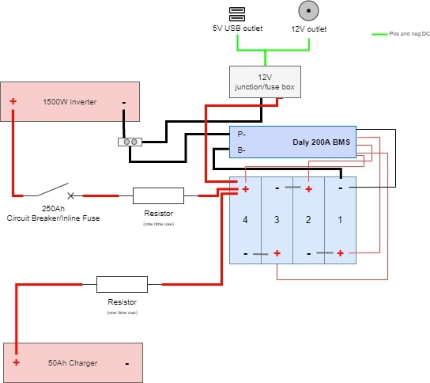
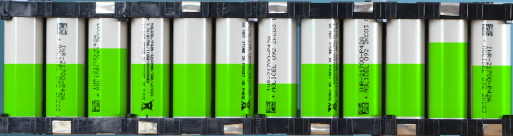

# DIY Power Station
This repo shows the progress of two young doughnuts building a power station for off-grid outdoor DJ music sessions with the lads.

We're building a **280Ah 12V power station able to withstand 1500W**. These were the specs we found best suited our needs. Since we are powering two speakers, a laptop, DJ mixer and lights, this gig is expected to give around 10 hours of non-stop tunes :notes:.

## Mate, why don't you buy your own power station? :thinking:
Glad you asked! Simple answer: *they're too expensive for what they're worth*. Even if you have warranty, the price per Wh (watt-hour) is ludicrous when compared to DIY solutions.

I don't need to link examples here. I'd be hard-pressed if you found a 280Ah 12V power station capable of running up to 1500W concurrent watts for less than 2000€ in the market. Ours caps at 1000€ (yes, including shipping from China) and also offers a great learning experience! Plus, you have the advantage of **modularity**, meaning you can add more cells in the future if you want. Or perhaps add more outlets? Or maybe add a solar controller so you can plug your solar panels? Maybe you can add a temp controller and add a few fans to control the temperature inside the case?

It's up to you to decide! :smile:

## Overview
Here's an overview of the power station, its components and the intended outlets. Bear in mind, this power station is *basic*; it only has the components we find essential. Sure, we can install a fan and controller for ventilation (and it is really cheap to do so) but we prefer to keep it simple here.

  

This is our personal opinion on what the power station should have *at minimum*. We've religiously followed [DIY Solar Forum's advice](https://diysolarforum.com/) on the best parts and cheapest approach possible (shout out to [Will Prowse](https://www.youtube.com/c/WillProwse), his channel is a goldmine for DIY generators and batteries). Granted, the forum's main focus lies on solar generators. However, we forewent some of the components since our power station is meant for outdoor, off-grid use and not to be connected to solar panels.

Henceforth, our basic list includes:
- [4pcs EVE 280Ah 3.2V cells](https://www.alibaba.com/product-detail/Exliporc-GER-New-Arrival-STOCK-3_1600189394072.html?spm=a2756.order-detail-ta-ta-b.0.0.ae512fc2j1AOER)
- [Daly BMS 200Ah 4s](https://offgridvan.life/shop/daly-12v-200a-bms-for-4s-lifepo4-battery)
- [1500W 12V 50Hz inverter](https://www.banggood.com/Mensela-IT-PS1-Pro-220V-50HZ-Intelligent-Screen-Solar-Pure-Sine-Wave-Power-Inverter-2200W-or-3000W-or-4000W-or-5000W-or-6000W-or-7000W-DC-50HZ-12V-or-24V-To-AC-220V-Converter-p-1789663.html?utm_source=emarsys&utm_medium=Outofstocknosplit&utm_campaign=trigger-order&utm_content=leander&sc_src=email_5007166&sc_eh=dc563cd3b58e91061&sc_llid=112806&sc_lid=225205703&sc_uid=7uZyj2v05v&cur_warehouse=CN&ID=518349555089)
- [WATE 14.6V 50Ah charger](https://pt.aliexpress.com/item/4000457912081.html?spm=a2g0o.order_list.0.0.3c89caa4neo3Uo&gatewayAdapt=glo2bra)
- basic hardware (plywood, resistor, fuse boxes, 250Ah circuit breaker, outlets, PTFE)

### Battery
When choosing a battery, it's important to know what type of cells to go for. We could have bought a pre-made AGM but it wouldn't be as cheap. So we decided to build one ourselves! Lithium Iron Phosphate batteries (known as **LiFePO4**) are a type of lithium ion rechargeable battery. They're cheaper, have better power output, weigh less and have double the cycles of traditional cobalt-base lithium ion batteries.

Given we decided to build a 12V a battery, we'd need ***four 3.2V cells in series***. We just needed to choose our capacity. Every concern and requirement goes back into the old adage: $$ W = V \cdot A$$
**Watts** equals to **volts** times **ampere**. Here's a list of our gear and their respective *consumption wattage*.

| Item             | Watts       |
| --------------   | ----------- |
| 2x Partybox 100  | 120W        |
| Laptop           | 50W         |
| Lights           | 60W         |
| Mixer            | 20W         |
| Laser            | 25W         |
| Fog machine      | 20W         |

They roughly add up to 295W. Using the formula, considering a 12V battery, we're looking at **25 amperes**. With this in mind, we went for **280Ah (amp/hour) cells**. We estimate that with these, taking into account 90% efficiency from the inverter and 90% efficiency discharge from the battery itself, it would leave us with a *very conservative, worst case scenario* window between 200-220Ah. This can translate to **a minimum 8 hours of full-blast outdoor DJ sets with lights, fog machine and laser** :tada: .

> We're not even *considering* that both speakers have in-built batteries that last up 6 hours by themselves and that the fog machine is used intermittently. The laptop also has its own battery!

#### Cells
The core of the battery. The cheapest options are across the globe, in China. [But it has its own risks](https://www.youtube.com/watch?v=EYqemUdIo08). Some cells in Alibaba, Aliexpress or Banggood are ridiculously cheap. But most of the times it's too good to be true. So you have to be careful.

There are infinite discussions about which Chinese brands are best or give the best bang for your buck. To keep it simple, and following DIYSolarForum's and Will Prowse's suggestions, try to stick to Grade A EVE LF280K (they're a Chinese manufacturer) cells.. There are many sellers who sell EVE cells (not all are legitimate, watch out!) on the most common Chinese e-commerce sites (Alibaba, Aliexpress...). [Amy Wuan](https://diysolarforum.com/threads/amy-wan-vs-amy-zheng-whats-the-difference.36957/) has a great reputation in the forums and it's your safest bet (even if they mess up, they usually just send you a replacement package).

Needless to say, you pay a wee more if you bet on Amy Wuan. You're essentially paying premium for the *safety* of having cheap Grade-A EVE cells. We took a *riskier approach*. We went for Exliporc as the seller, through Lillian Li. It's a bit more daring but people have ordered from them in the past and it's they seem to uphold a [satisfactory reputation](https://diysolarforum.com/threads/new-eve-lf280k-16s-build-from-exliporc.38130/).

Here's hoping! :crossed_fingers:

When purchasing, do ask for a photo of the cells QR Codes. They are extremely helpeful to verify if the cells are legit and Grade-A. [Here's a quick way of reading the cell QR Code](https://www.reddit.com/r/LiFePO4battery/comments/pujggt/how_to_quickly_identify_fake_lfp_battery_cells/).

Don't forget to check the box when they arrive and run tests on the cells to check their health and true capacity. You can open disputes on Alibaba and try to score a refund (try to pay with credit card or Paypal for better protection).

----

##### Notes about cells when they arrive
It's important to top balance the cells. Here's a quick lesson about voltage and discharge capacity on LiFePO4 cells. Check the following image. These cells maintain roughly the same voltage between 90% and 20% capacity.

  

So when you open up your brand new cells and observe that the voltage is 3.25V, it means the battery can be 40% or 80% charged, for example.

Now take this and put four cells in series (thus making a 12V battery). If you use the battery, they all discharge at the same time. It means that one cell might be discharged *first* than the others (under-charge). The same thing can happen when charging, leading to over-charge. This is damaging to the cells long-term and can seriously effect their lifespan.

  

Therefore, we **top-balance them**. In other words, we charge all the cells to the same capacity and voltage and make sure they're all lined up! There are loads of videos on how to top balance (here's [two](https://www.youtube.com/watch?v=x5ABvbbics8&t=2s) of our [favourites](https://www.youtube.com/watch?v=RPtT8KAtsJA)). In layman's terms, you connect the cells in parallel and use a DC charger to charge them up to 3.65V. This is the simplest way of doing it. Check the second video linked for a faster approach.

Don't forget to clamp the cells while charging! Cell compression helps extend their lifespan and it's good for their overall health! Check the [Case](#case) section for more details.

> :v: **Quick tip** If you don't have a DC charger, I recommend you getting the [EBC-A20](https://pt.aliexpress.com/item/1005003097310721.html?spm=a2g0o.search0304.0.0.7d0516d9igJgla&algo_pvid=854fff39-1335-4a75-ad1d-4145f4b768a2&algo_exp_id=854fff39-1335-4a75-ad1d-4145f4b768a2-14&pdp_ext_f=%7B%22sku_id%22%3A%2212000024063776342%22%7D&pdp_npi=2%40dis%21EUR%21%21102.34%21%21%2111.73%21%21%400bb0623316541173981173071e2a88%2112000024063776342%21sea&gatewayAdapt=glo2bra) tester. This little machine discharges the battery at 20Ah and charges it at 5Ah. The great thing about it is that you can run capacity tests with it (it comes with a software that plots the graph for you) and also charges the battery (albeit a bit slow). It's the best bang for your buck if you want to run capacity tests and charge your cells for top-balancing. 

> You [really should](https://www.youtube.com/watch?v=3dmWqHR7b9w) run capacity tests to check for the cells' true capacity and their overall health. [Here's a great rundown](https://www.youtube.com/watch?v=bx7Df_nbv0A) for the aforementioned capacity tester. Trust me, it's really useful, cheap and simple!

----

#### BMS
`//TODO`

#### Case
We have a layout of the case that will compress the cells when charging/top balancing (people find it optional but [it's been proven that compression helps extending the cells' lifespan, given they tend to bloat when charged](https://www.youtube.com/watch?v=cwBxe4cu3yo)) and have a structure to roof the BMS on top of the cells. This unit will act as the battery and will encompass of the 280Ah cells and Daly BMS 200Ah.

The Lightburn project file assumes the usage of **9mm plywood**. Since we luckily can use [a 130W CO2 laser cutting machine](https://github.com/nelsonic/nelsonic.github.io/issues/455#issuecomment-549803532), the speed and power settings of each layer have been tweaked using [this calculator](https://mantechmachinery.co.uk/laser-cutter-parameters/), to both cutting and engraving.

### Inverter
`//TODO`

### Great video references
`//TODO`
